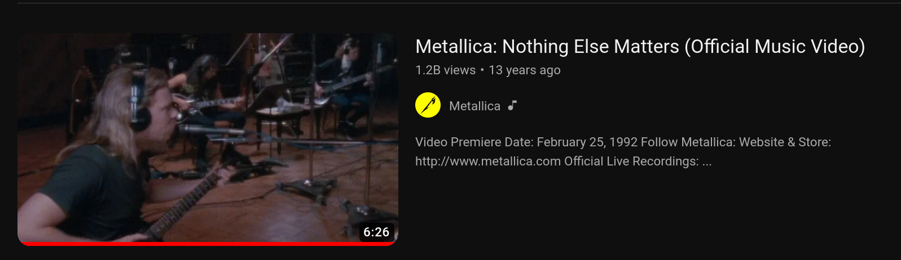

# Lesson 2 - homework

Instructions for submitting the homework: [Submitting homework](../../lesson01/02_submittingHomework/README.md)

## Exercises

Read: [A good basis for accessibility](https://developer.mozilla.org/en-US/docs/Learn/Accessibility/HTML)

### Previous assignments

Now that you have more insight into accessible and semantic HTML, you can assess the assignments from the previous assignment and reevaluate the markup: is it accessible? Is it semantic? Is it respecting the fact that markup is meant only for semantics?

### Contact form

Implement markup for this contact form:

Pay special attention to rows with multiple inputs and one label. Hint: [Google](https://www.google.com/search?q=html+label+for+2+inputs)

### Youtube video element

Implement markup for the youtube video element:

